# Orient - Kelola Acara Jadi Mudah 🎉

<div align="center">


**Aplikasi Pendamping Terbaik untuk Manajemen Event Kamu**

[](https://flutter.dev)
[](https://firebase.google.com)
[](https://dart.dev)
[](LICENSE)

</div>

---

## 👥 Identitas Mahasiswa

1. Desi Maria Elita Silalahi - 231401044
2. Diva Syakirahana - 231401077
3. Fadjar Maulana Ikhsan - 231401092

---

## ✨ Fitur Utama

### 🔐 Autentikasi & Manajemen Pengguna
- Sign up dan login manual
- Integrasi Google Sign-In
- Manajemen profil dengan foto profil
- Sistem pertemanan untuk menambah kolaborator

### 📅 Manajemen Event
- Tambah, edit, dan hapus event
- Countdown timer untuk setiap event
- Detail event lengkap (nama, tanggal, lokasi, total budget, status)
- Tambahkan kolaborator ke event
- Dashboard summary untuk overview event

### ✅ Manajemen Task
- Buat, edit, dan hapus task
- Kategorisasi task (Attire & Accessories, Health & Beauty, Music & Show, dll)
- Tentukan due date dan status task (completed/pending)
- Tambahkan note dan gambar pada task
- Visualisasi progress task dengan pie chart
- Lihat task yang jatuh tempo hari ini

### 💵 Kontrol Anggaran
- Tentukan budget untuk setiap event
- Tambah item budget dengan kategori
- Lacak total cost, paid amount, dan unpaid amount
- Kelola progress pembayaran (full payment atau cicilan)
- Visualisasi budget dengan pie chart
- Riwayat pembayaran dengan timestamp
- Tambahkan note dan gambar pada item budget

### 🏪 Manajemen Vendor
- Tambah, edit, dan hapus vendor
- Kategorisasi vendor berdasarkan layanan
- Simpan informasi kontak vendor (telepon, email, website, alamat)
- Lacak status agreement (accepted, pending, rejected)
- Tracking pembayaran vendor
- Otomatis tambahkan biaya vendor ke budget control
- Visualisasi spending vendor dengan pie chart

### 👨‍👩‍👧‍👦 Manajemen Tamu
- Tambah, edit, dan hapus tamu
- Simpan informasi detail tamu
- Undang tamu ke event tertentu
- Kelola status undangan (sent, not sent, pending, accepted, denied)
- Atur seating (table assignment)
- Menu assignment untuk setiap tamu
- Lihat total tamu per event

### 💬 Kolaborasi & Komunikasi
- Tambahkan kolaborator ke event
- Fitur chat internal untuk komunikasi tim
- Sinkronisasi data real-time
- Lihat riwayat perubahan oleh kolaborator

### 📸 Manajemen Media
- Upload dan simpan gambar untuk task, budget, dan vendor
- Galeri foto terkait event

---

## 📱 Screenshot

<div align="center">

### Alur Autentikasi
<table>
  <tr>
    <td align="center">
      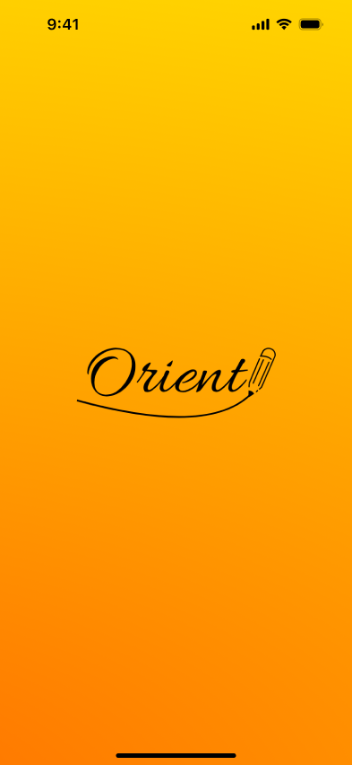
      <br />
      <sub><b>Splash Screen</b></sub>
    </td>
    <td align="center">
      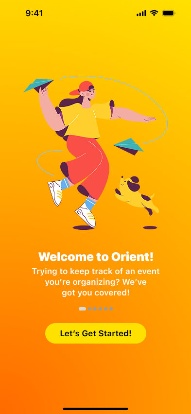
      <br />
      <sub><b>Welcome Screen</b></sub>
    </td>
    <td align="center">
      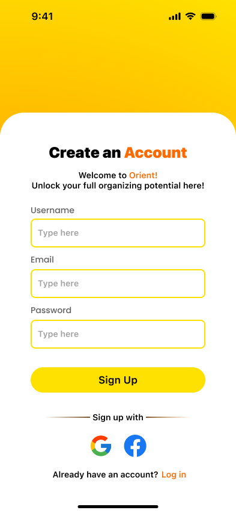
      <br />
      <sub><b>Halaman Login</b></sub>
    </td>
    <td align="center">
      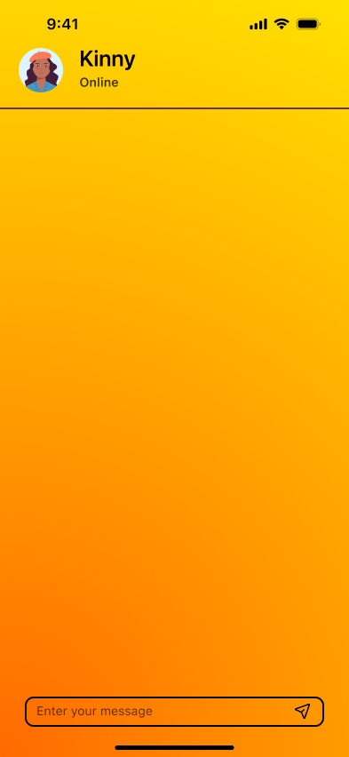
      <br />
      <sub><b>Halaman Onboarding</b></sub>
    </td>
  </tr>
</table>

### Fitur Utama
<table>
  <tr>
    <td align="center">
      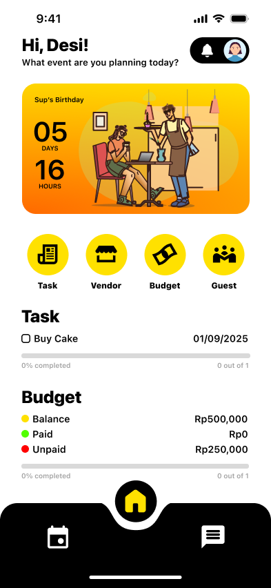
      <br />
      <sub><b>Dashboard Utama</b></sub>
    </td>
    <td align="center">
      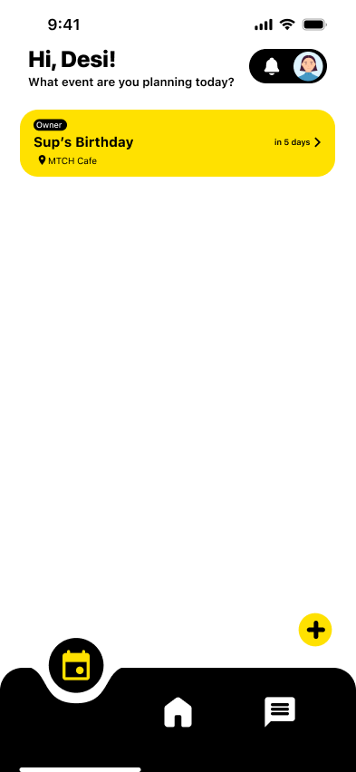
      <br />
      <sub><b>Daftar Event</b></sub>
    </td>
    <td align="center">
      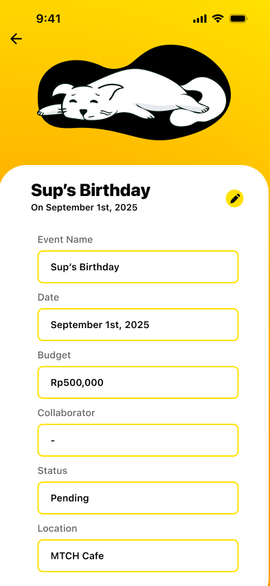
      <br />
      <sub><b>Detail Event</b></sub>
    </td>
    <td align="center">
      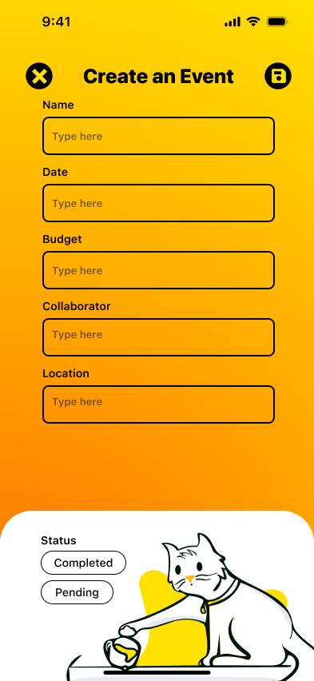
      <br />
      <sub><b>Tambah Event</b></sub>
    </td>
  </tr>
</table>

### Manajemen Task
<table>
  <tr>
    <td align="center">
      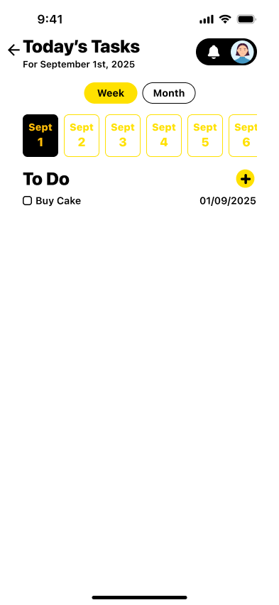
      <br />
      <sub><b>Daftar Task Per Minggu</b></sub>
    </td>
    <td align="center">
      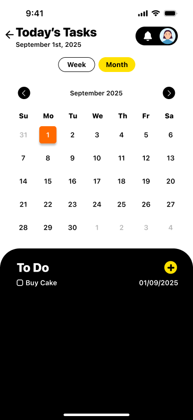
      <br />
      <sub><b>Daftar Task Per Bulan</b></sub>
    </td>
    <td align="center">
      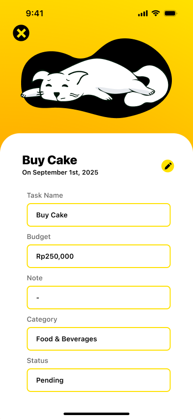
      <br />
      <sub><b>Detail Task</b></sub>
    </td>
    <td align="center">
      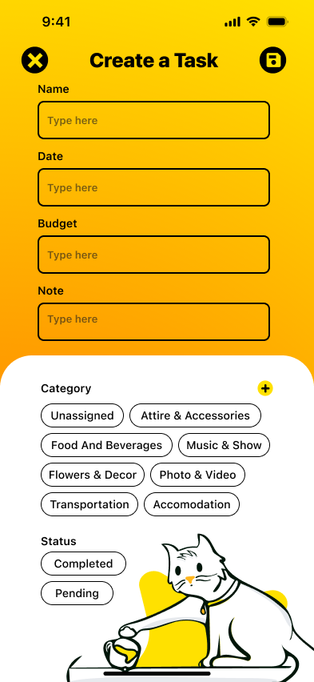
      <br />
      <sub><b>Tambah Task</b></sub>
    </td>
  </tr>
</table>

### Manajemen Budget
<table>
  <tr>
    <td align="center">
      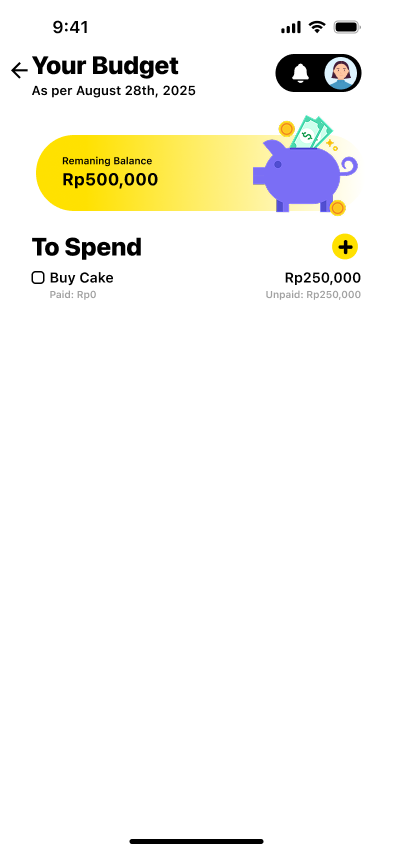
      <br />
      <sub><b>Budget List</b></sub>
    </td>
    <td align="center">
      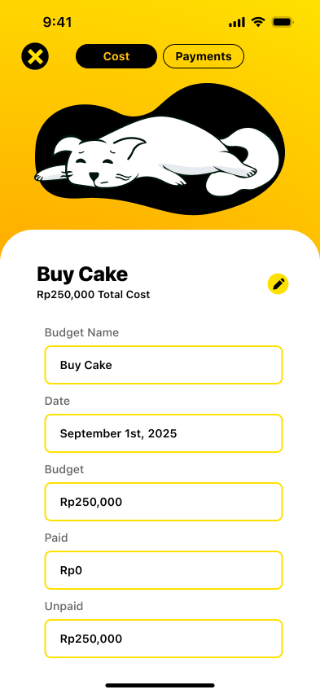
      <br />
      <sub><b>Detail Budget (Cost)</b></sub>
    </td>
    <td align="center">
      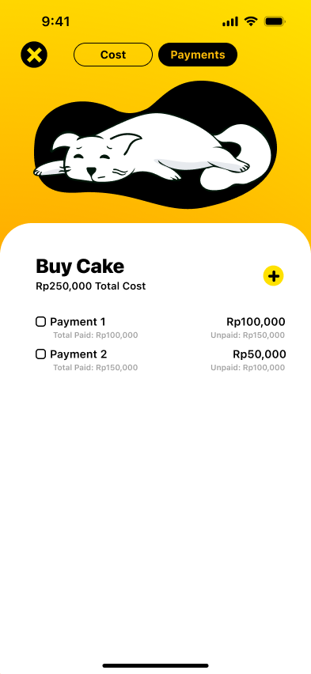
      <br />
      <sub><b>Detail Budget (Payment)</b></sub>
    </td>
  </tr>
</table>

### Manajemen Vendor
<table>
  <tr>
    <td align="center">
      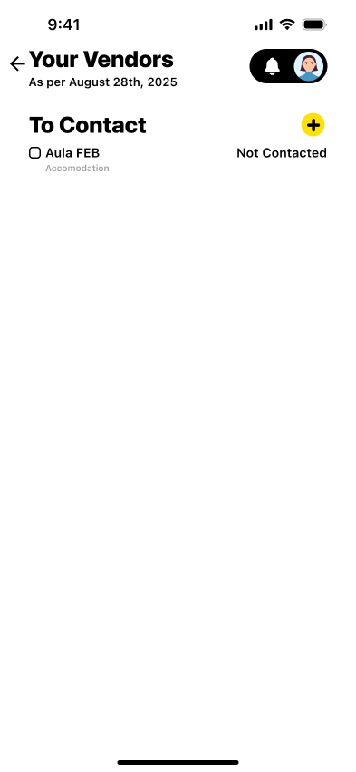
      <br />
      <sub><b>Vendor List</b></sub>
    </td>
    <td align="center">
      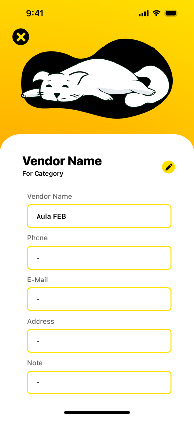
      <br />
      <sub><b>Vendor Detail</b></sub>
    </td>
    <td align="center">
      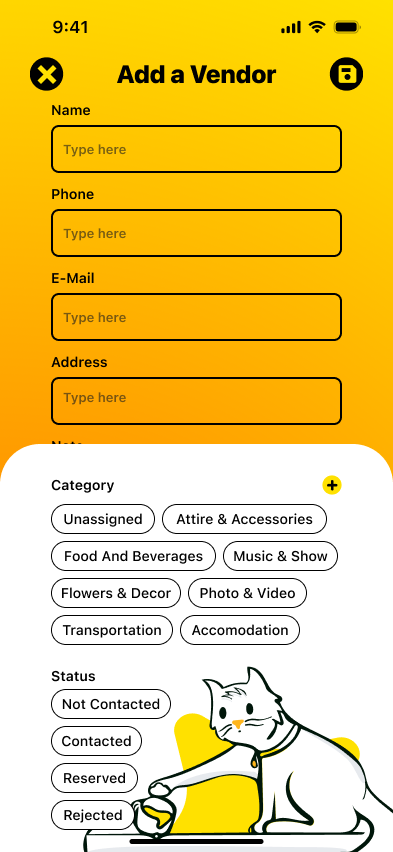
      <br />
      <sub><b>Add Vendor</b></sub>
    </td>
  </tr>
</table>

### Manajemen Tamu
<table>
  <tr>
    <td align="center">
      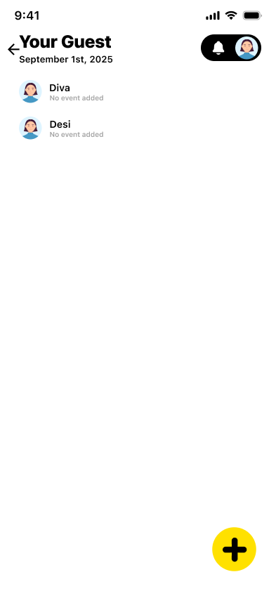
      <br />
      <sub><b>Daftar Tamu</b></sub>
    </td>
    <td align="center">
      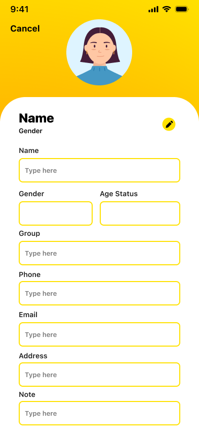
      <br />
      <sub><b>Detail Tamu</b></sub>
    </td>
    <td align="center">
      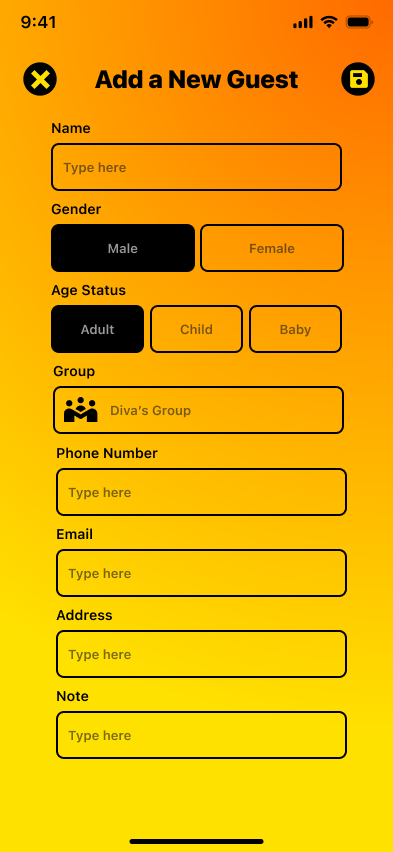
      <br />
      <sub><b>Daftar Chat</b></sub>
    </td>
  </tr>
</table>

### Chat
<table>
  <tr>
    <td align="center">
      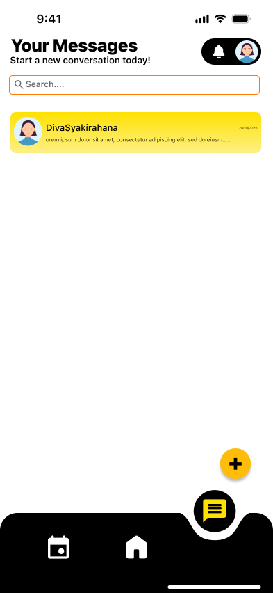
      <br />
      <sub><b>Daftar Chat</b></sub>
    </td>
    <td align="center">
      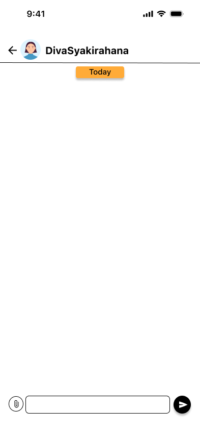
      <br />
      <sub><b>Room Chat</b></sub>
    </td>
  </tr>
</table>

</div>

---

## 🛠 Teknologi

### Frontend
- **Flutter** - Framework UI untuk membuat aplikasi native
- **Dart** - Bahasa pemrograman untuk Flutter
- **Material Design** - Sistem desain untuk UI yang intuitif

### Backend & Layanan
- **Firebase Authentication** - Autentikasi dan manajemen sesi pengguna
- **Firebase Firestore** - Database NoSQL real-time
- **Firebase Storage** - Cloud storage untuk gambar dan media
- **Firebase Cloud Messaging** - Push notifications (dalam perencanaan)

### Library & Package Utama
```yaml
dependencies:
  flutter:
    sdk: flutter
  firebase_core: ^latest
  firebase_auth: ^latest
  cloud_firestore: ^latest
  firebase_storage: ^latest
  google_sign_in: ^latest
  image_picker: ^latest
  fl_chart: ^latest
  encrypt: ^latest
```

### Tools Development
- **Android Studio** - IDE untuk pengembangan Flutter
- **Git** - Version control system
- **Figma** - Tool desain UI/UX

---

## 🚀 Cara Memulai

### Prasyarat
- Flutter SDK (3.0 atau lebih tinggi)
- Android Studio / VS Code
- Android device atau emulator (Android 5.0 Lollipop / API Level 21 atau lebih tinggi)
- Akun Firebase

### Instalasi

1. **Clone repository**
   ```bash
   git clone https://github.com/dipwaaaa/Orient.git
   cd orient-app
   ```

2. **Install dependencies**
   ```bash
   flutter pub get
   ```

3. **Setup Firebase**
    - Buat project Firebase baru di [Firebase Console](https://console.firebase.google.com)
    - Tambahkan aplikasi Android ke project Firebase
    - Download `google-services.json` dan letakkan di `android/app/`
    - Aktifkan Authentication (Email/Password dan Google Sign-In)
    - Buat Firestore Database
    - Setup Firebase Storage

4. **Konfigurasi Firebase**
    - Update `android/app/build.gradle` dengan application ID kamu
    - Tambahkan Firebase SDK dependencies

5. **Jalankan aplikasi**
   ```bash
   flutter run
   ```

### Build untuk Release

```bash
flutter build apk --release
```

APK akan dihasilkan di `build/app/outputs/flutter-apk/app-release.apk`

---

## 🏗 Arsitektur

Orient menggunakan **model data berbentuk V** dengan Events di tengah:

```
         Users ─────┐
        Guests ─────┤
    Categories ─────┤
         Chats ─────┤
      Messages ─────┤
                    │
                 EVENTS (Pusat)
                    │
        Tasks ──────┤
      Budgets ──────┤
      Vendors ──────┘
```

### Struktur Database

- **Koleksi Firestore:**
    - `users` - Profil pengguna dan data autentikasi
    - `events` - Informasi event dan metadata
    - `tasks` - Daftar task dengan tracking status
    - `budgets` - Item budget dan tracking pembayaran
    - `vendors` - Informasi vendor dan agreement
    - `guests` - Daftar tamu dan status undangan
    - `categories` - Kategori custom untuk organisasi
    - `chats` - Metadata ruang chat
    - `messages` - Pesan terenkripsi

### Fitur Keamanan
- Enkripsi AES-256-CBC untuk pesan chat
- Role-based access control untuk kolaborator
- Firebase Security Rules untuk proteksi data
- Penyimpanan token yang aman untuk autentikasi

---

<div align="center">

**Dibuat dengan ❤️ oleh Kelompok Kucing Oyen**

</div>